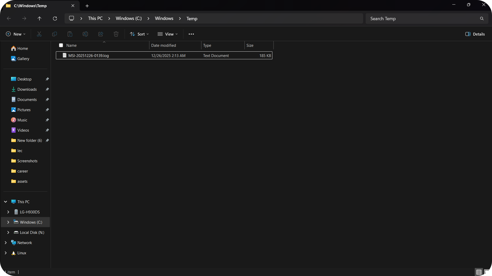
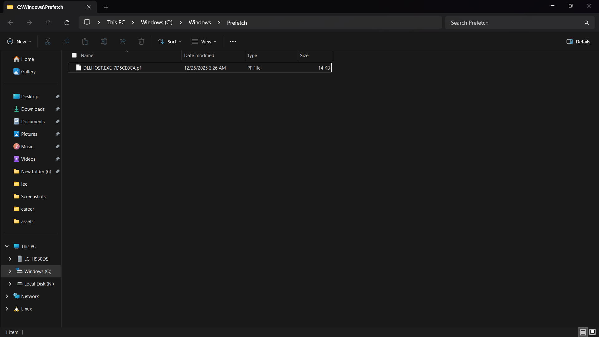

# Windows Cleanup Tool

Batch script to clean temporary system files on Windows with a simple intro and GitHub redirect.

---

## 🚀 Usage & Features
1. Download the file `cleanup_tool.bat`.
2. Run it as **Administrator** (important for system file access).
3. The tool will:
- Deletes  files
- Cleans  directory
- Cleans  directory (`%TEMP%`)

---

## 📷 Screenshoots

| Output | Temp(after) | Prefetch(after)
|---------|---------|---------|
|   | | |

---

## ⚠️ Notes
- Some system files are protected by Windows and cannot be deleted (this is normal).
- Always run the script with **Admin rights** for full effect.
- Tested on Windows 10/11.

---

## 🚀 Future Plans

### 🔧 Functional Enhancements
- Add **log file generation** for tracking cleanup actions  
- Implement **admin privilege detection** for protected folders  
- Include **progress bar or status messages** for better feedback  
- Support **custom cleanup paths** via arguments or config file  

---

### 🎨 Visual
- Integrate **GUI launcher** (PowerShell/WinForms)  
- Add **dynamic ASCII art intro** with random styles

---

### 📦 Packaging 
- Release **EXE version**   

---

## 👤 Author
Created by **MazenHamza**  
[If you encounter any issues, bugs, or have suggestions for improvements, please open an [Issue](https://github.com/Mazenjamza/Windows-Cleanup-Tool/issues) on GitHub.  
For direct contact, you can reach me at]  

  
  
  

  
  Thank you for choosing me.❤️
